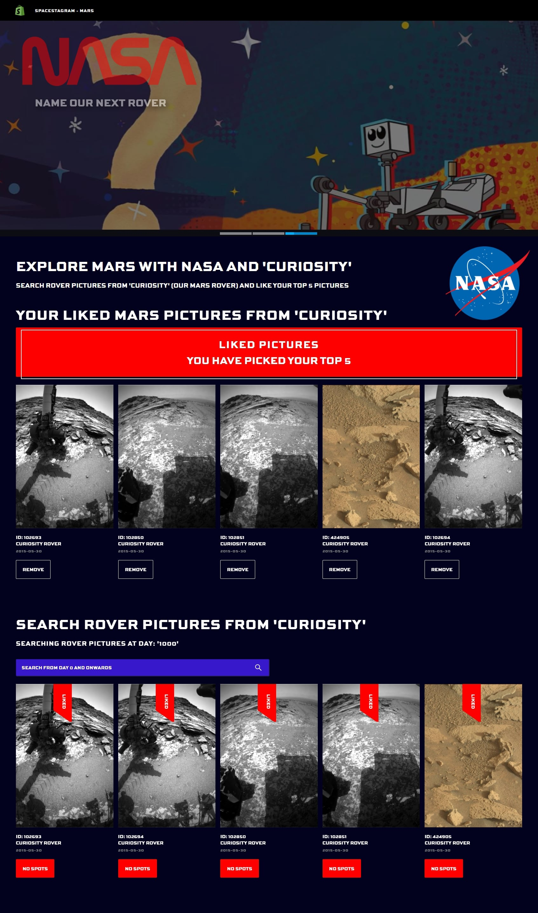

# Disclaimer - This challenge is based on a previous successful admission to the Shopify challenge 8 months ago. Hence, certain files are 8 months old.
https://github.com/mattfrancis888/shopify1

# Shopify Challenge - Spacestagram: Image-sharing from the final frontier

For the purposes of this project, Shopify is extending our mission to Make Commerce Better for Everyone to include the whole entire universe. Please build us an app to help share photos from one of NASA’s image APIs.

Developed with React, React Spring, Typescript, JS, HTML, CSS.

### The Challenge

We need a webpage that can pull images, and allow the user to “like” and “unlike” their favourite images.

We'd like a simple to use interface that makes it easy to:

-   Fetch data from one of NASA’s APIs and display the resulting images (more details under Technical Requirements)
-   Display descriptive data for each image (for example: title, date, description, etc.)
-   Like an image
-   Unlike an image

### Technical requirements

1. Search results should come from NASA’s free APIs, for which you’ll need a free API key from https://api.nasa.gov -
    - you do not need to enter anything more than your first name, last name, and email address (i.e. application url is not required)
    - We’ve provided screenshots below of demo apps we built using the Astronomy Picture of the Day or Mars Rover Photos APIs (along with Shopify’s open source React component library: Polaris).
    - You are free to use any NASA API you like
    - You are free to use any front end framework/component library you like (or none at all!)
2. Each image result should list at least a title, date of capture (ideally in earth_date) and a button to “like” that image.
3. Each image can be “liked”, and a user should be able to undo their “like”
4. The HTML that ends up being served client-side should be accessible and semantic (MDN reference)

## External Resources:

-   Postman to test API requests.
-   Prettier to format code and EsLint for linting.
-   React dev tool to check the value of props.

## What It Looks Like




# Getting Started

These instructions will get you a copy of the project up and running on your local machine for development and testing purposes.

1. Clone the project. Use `npm install` to install all the dependencies. Go to the client directory, run the project with `npm start` for development or `npm run build` for production.

2. OPTIONAL: If you want to make changes locally, on the terminal, go to the `backend` directory. Type `npm run convert` to start the local server. The command would also listen to changes and convert the Express Typescript files to Express Javascript files that will be used for production. Create your own local database by restoring the pg_dump file of the steam database given (called steam_prod). Configure your own Pool settings in databasePool.

# Prerequisites

What things you need to install the software

```
- Any package manager (npm, yarn)
```

# Versioning

None
